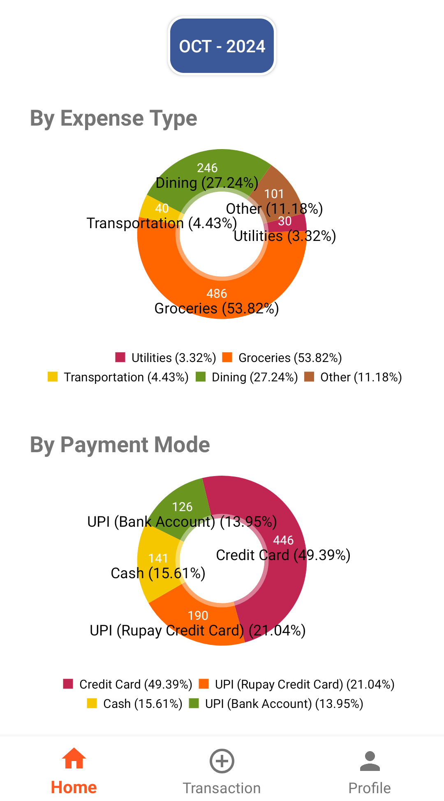

# Daily Expenses Android App

Welcome to **Daily Expenses**, the simple and powerful app designed to help you take control of your finances. Whether you want to track your daily spending, monitor specific expenses, or stick to a budget, **Daily Expenses** has you covered!

## Why Use Daily Expenses?

Managing your money can be overwhelming, but it doesn’t have to be! With the **Daily Expenses** app, you can easily:

- Stay on top of your expenses without effort.
- Visualize where your money is going.
- Set realistic daily and monthly budget limits.
- Gain insights with clear and intuitive pie charts for better financial planning.

## Key Features

Here’s what **Daily Expenses** can do for you:

- **Effortless Expense Tracking**: Quickly log your daily expenses across various categories, such as groceries, dining, transportation, utilities, and more. You can also add custom categories that fit your lifestyle.
  
- **Visual Expense Breakdown**: Get a clear picture of your spending with easy-to-understand pie charts that categorize your expenses by type (e.g., groceries, dining) and payment mode (e.g., credit card, cash, UPI).

- **Transaction History**: Keep track of all your previous transactions. The app maintains a complete passbook that shows detailed transaction history so you can review your spending patterns anytime.

- **Budget Limits**: Set daily and monthly budget limits to manage your spending effectively. The app will notify you if you're approaching your budget, ensuring you always stay on track!

- **Payment Modes**: You can log payments made through multiple modes such as:
  - **Credit/Debit Cards**
  - **UPI (Unified Payments Interface)**
  - **Bank Transfers**
  - **Cash Payments**
  
- **User-Friendly Interface**: The app is designed to be intuitive, making it easy for anyone to use, whether you're new to budget tracking or a seasoned pro. Enjoy seamless navigation and a smooth user experience.

- **Profile Management**: Customize your profile and preferences to make the app suit your specific needs. You can also manage and adjust your budget settings through your profile section.

## How to Get Started

### Prerequisites

- **Android OS**: The app runs smoothly on any Android device running Android 8.0 or higher. 

### Installation Steps

1. **Download from Google Play**:  
   Head over to the Google Play Store and search for "Daily Expenses" or click [here](https://play.google.com/store/apps) to download directly. Once installed, open the app to get started.

2. **Set Up Your Profile**:  
   Upon your first launch, the app will guide you through setting up your profile, including setting up your budget limits.

3. **Start Adding Expenses**:  
   Begin logging your daily transactions by clicking the "+" button on the home screen. Choose a category, enter the amount, and select the payment method used.

4. **Review and Analyze**:  
   View your expenses through the intuitive pie charts. These charts break down your spending by category and payment method, giving you a complete view of where your money is going.

## Screenshots

Here’s a glimpse of the **Daily Expenses** app in action:

## Frequently Asked Questions (FAQ)

### 1. **How do I edit or delete a transaction?**  
To edit or delete a transaction, head to your transaction history, tap on the transaction you want to edit, and select the appropriate option.

### 2. **Can I create custom expense categories?**  
Yes! You can create custom categories to match your personal spending habits. Simply go to the settings and add new categories.

### 3. **Is my data secure?**  
Absolutely. All of your transaction data is stored locally on your device, and the app doesn’t require an internet connection, so your financial information stays private.

### 4. **Can I export my expense data?**  
Not yet, but this feature is coming soon in future updates! Stay tuned for more enhancements.

## Need Help?

If you have any questions, feedback, or suggestions, feel free to reach out to our support team by emailing himanshumauri@gmail.com. We're here to help!

## Upcoming Features

We are constantly working to improve the app, and future updates will include:

- **Data Backup & Sync**: Save your data and access it from multiple devices.
- **Recurring Transactions**: Automate the logging of frequent expenses such as rent or subscription services.
- **Dark Mode**: A sleek, dark theme to make viewing easier on the eyes.
  
Stay tuned for these exciting updates!

---

We hope **Daily Expenses** helps you stay on top of your finances and meet your financial goals! Download it today and take the first step toward better money management.
